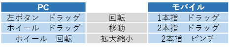
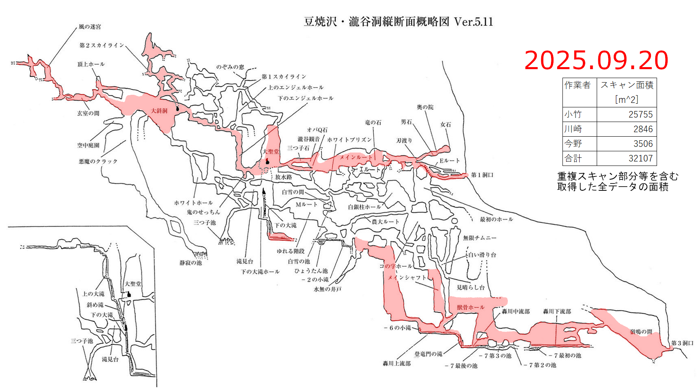

## 操作方法  
   
※モバイルによる表示では正常に動作しない場合があります。  
※1つの洞窟データにつき30～100MB程度のサイズがあります。  
  

   

## 瀧谷洞スキャン  
 
<a href = "https://cavemapper.github.io/CaveViewer/Roukokudo_Entrance1_Daiseido/" >**第一洞口～大聖堂**</a>  

<a href = "https://cavemapper.github.io/CaveViewer/Roukokudo_Bottom_of_Shita_no_Ootaki/" >**下の大滝の下部**</a>  

<a href = "https://cavemapper.github.io/CaveViewer/Roukokudo_ReimeiNoMa_TodorokiGawa/" >**黎明の間～轟川まで**</a>  
  
<a href = "https://cavemapper.github.io/CaveViewer/Roukokudou_Fhole_to_suribachi/" >**Fホール～すり鉢状の穴**</a> 
 

 

 
<a href = "https://github.com/CaveMapper/CaveMapper">TOPに戻る</a> 